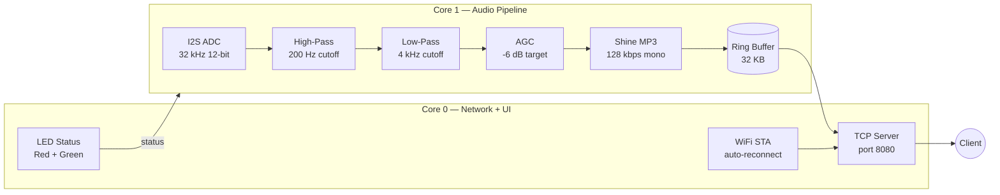

<picture>
  <source
    width="100%"
    srcset="./docs/banner.png"
    media="(prefers-color-scheme: dark)"
  />
  <source
    width="100%"
    srcset="./docs/banner.png"
    media="(prefers-color-scheme: light), (prefers-color-scheme: no-preference)"
  />
  
</picture>

<h1 align="center">Project Xapyra</h1>

<p align="center">Lightweight ESP32 audio streamer — captures mic input, processes it, encodes to MP3, and streams over TCP in real time.</p>

<p align="center">
  
  
  
  
</p>

<p align="center">
  [<a href="#quick-start">Quick Start</a>]
  [<a href="#architecture">Architecture</a>]
  [<a href="#configuration">Configuration</a>]
  [<a href="#hardware">Hardware</a>]
</p>

> [!TIP]
> Xapyra runs two FreeRTOS tasks across the ESP32's dual cores — one for audio capture + MP3 encoding, one for TCP streaming + LED status — so neither blocks the other.

> [!NOTE]
> All audio processing (high-pass, low-pass, AGC) and MP3 encoding happen **on-device**. No external processing required.

## What's So Special About This Project?

Xapyra is a **minimal, focused ESP32 audio streamer**. No cloud dependencies, no heavy frameworks — just ADC capture, DSP filtering, MP3 encoding via Shine, and TCP streaming.

- **Lightweight:** runs on any ESP32 DevKit, no PSRAM required
- **Real-time:** dual-core FreeRTOS pipeline, ~32 kHz sample rate
- **Self-contained:** bundled Shine MP3 encoder, no external libs beyond WiFi

## What Does Xapyra Do?

| Stage | Description |
|---|---|
| **Capture** | I2S ADC reads mic input at 32 kHz, 12-bit |
| **Filter** | High-pass (200 Hz cutoff) + low-pass (4 kHz cutoff) isolates vocals |
| **AGC** | Automatic gain control normalizes levels to ~-6 dB peak |
| **Encode** | Shine MP3 encoder — 128 kbps mono |
| **Stream** | TCP server on port 8080, streams MP3 frames to connected client |
| **Status** | Red LED = WiFi down, Green LED solid = idle, Green LED flicker = streaming |

## Architecture



## Quick Start

### Prerequisites

- [PlatformIO CLI](https://platformio.org/install/cli) or VS Code + PlatformIO extension
- ESP32 DevKit V1 (or compatible)
- Microphone connected to ADC1 Channel 7 (GPIO 35)

### Build & Flash

```bash
# Clone the repo
git clone https://github.com/daniswastaken/Xapyra.git
cd Xapyra

# Build
pio run

# Flash to ESP32
pio run --target upload

# Monitor serial output
pio device monitor
```

### Connect

1. Power on the ESP32 — red LED indicates WiFi is connecting
2. Once connected, green LED turns solid (idle)
3. From any machine on the same network:

```bash
# Linux/macOS
nc <ESP32_IP> 8080 | mpv -

# Windows (PowerShell)
ncat <ESP32_IP> 8080 | mpv -
```

4. Green LED flickers while streaming

## Configuration

Edit `src/main.cpp` — all settings are `#define` constants at the top:

```cpp
// WiFi
#define WIFI_SSID       "YOUR_SSID"
#define WIFI_PASSWORD   "YOUR_PASSWORD"
#define TCP_PORT        8080

// Audio
#define TARGET_SAMPLE_RATE 32000
#define ADC_CHANNEL        ADC1_CHANNEL_7

// LEDs
#define PIN_RED_LED     25
#define PIN_GREEN_LED   26
```

### Audio Pipeline Tuning

| Parameter | Default | Description |
|---|---|---|
| `HP_ALPHA` | 0.9622 | High-pass filter alpha (200 Hz cutoff at 32 kHz) |
| `LP_ALPHA` | 0.7788 | Low-pass filter alpha (4 kHz cutoff at 32 kHz) |
| `AGC_TARGET` | 20000.0 | Target peak level (~-6 dB) |
| `AGC_MAX_GAIN` | 8.0 | Maximum AGC gain |
| `AGC_ATTACK` | 0.1 | Gain reduction speed |
| `AGC_RELEASE` | 0.001 | Gain recovery speed |

## Hardware

### Wiring

| Component | Pin |
|---|---|
| Microphone (analog) | GPIO 35 (ADC1_CH7) |
| Red LED | GPIO 25 |
| Green LED | GPIO 26 |
| GND | Common ground |

### Requirements

- **Board:** ESP32 DevKit V1 (or any ESP32 with WiFi + ADC)
- **Microphone:** Analog mic (MAX9814, electret, etc.) connected to GPIO 35
- **Power:** USB or 5V VIN
- **No PSRAM required** — ring buffer fits in internal SRAM

## Project Structure

```
Xapyra/
├── src/
│   └── main.cpp          # Entry point — WiFi, audio pipeline, TCP server
├── lib/
│   └── shine/            # Bundled Shine MP3 encoder (fixed-point, no float)
├── include/              # Project headers
├── docs/
│   └── banner.png        # Project banner
├── test/                 # (placeholder)
├── platformio.ini        # PlatformIO configuration
└── LICENSE               # MIT
```

## Troubleshooting

| Symptom | Likely Cause | Fix |
|---|---|---|
| Red LED stays on | WiFi credentials wrong or AP down | Check `WIFI_SSID` / `WIFI_PASSWORD` |
| Green LED never flickers | No client connecting | Ensure client connects to `<ESP32_IP>:8080` |
| Audio is choppy | Ring buffer overflow | Increase `RING_BUF_SIZE` or check WiFi signal |
| `i2s_driver_install` fails | GPIO 35 conflict | Ensure no other peripheral uses ADC1_CH7 |
| Compiler error about `shine.h` | Library not found | Run `pio run` — lib is bundled in `lib/shine/` |

## License

[MIT](LICENSE) — Handaru Daniswara, 2026
